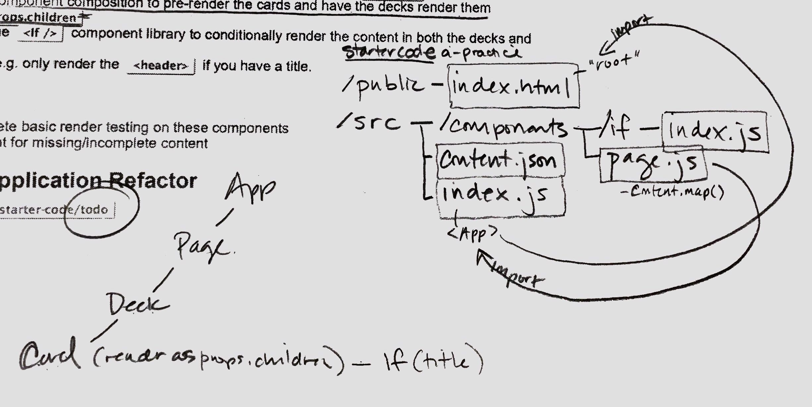

# lab-29-routing-and-component-configuration-a-practice

### Author: Gina Pultorak

### Links and Resources
* [submission PR](https://github.com/ginapult-401-advanced-javascript/lab-29-routing-and-component-configuration-a-practice/pull/2)
* [travis](https://travis-ci.com/ginapult-401-advanced-javascript/lab-29-routing-and-component-configuration-a-practice)
* [front-end](https://lab-29-routing-and-component-composition-a-practice.netlify.com/)

#### Documentation
* [styleguidist](n/a)

#### UML
